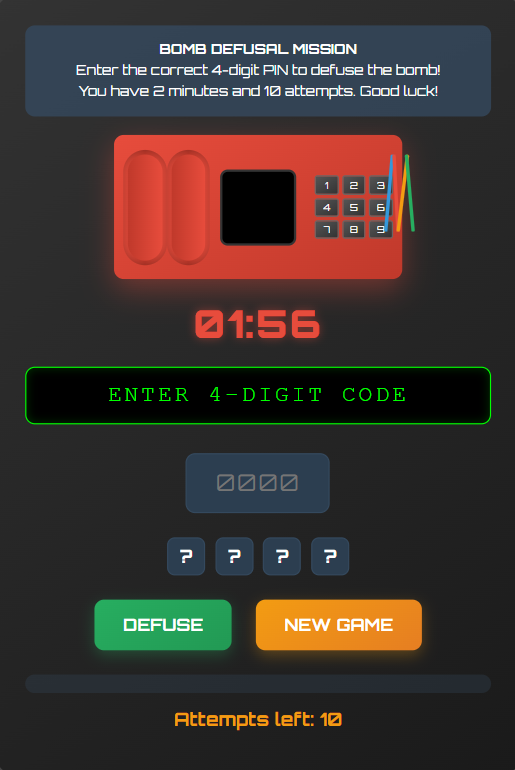

# 💣 Bomb Defusal Puzzle Game - CTF Challenge

A timed, hacker-style *web-based puzzle game* where players must defuse a virtual bomb by solving clues or entering the correct code. Built for CTF events and hacker challenges.

---

## 🎯 Objective

> You have limited time to *defuse the bomb* by cracking the puzzle or guessing the right code. Wrong guesses trigger a virtual explosion! 💥

---

## 🔗 Play Now

👉 [Click Here to Play the Game](https://kamesh-the-hacker.github.io/bomb-defusal-game/)

> Hosted via *GitHub Pages* — no installation needed.

---

## 🧠 Features

- 🧩 Puzzle-based bomb defusal challenge
- ⏱ Countdown timer for pressure
- 💻 Hacker-themed UI
- 🎮 Built with HTML, CSS, and JavaScript

---

## 🖼 Screenshot

> (Add a screenshot to your repo and update the path below)



```markdown
---

👨‍💻 Author

Kamesh the Hacker
🔗 GitHub: @kamesh-the-hacker


---

⚠ Disclaimer

This is a fictional puzzle game designed for fun and CTF purposes only. Do not use or interpret it as a real bomb-related tool.


---

📜 License

MIT License

---

If you'd like, I can also:
- Generate a hacker-style b1.png
- Add meta tags so your game link shows a preview on Discord/X
- Help you expand the game with levels, animations, or sound

Just let me know!
